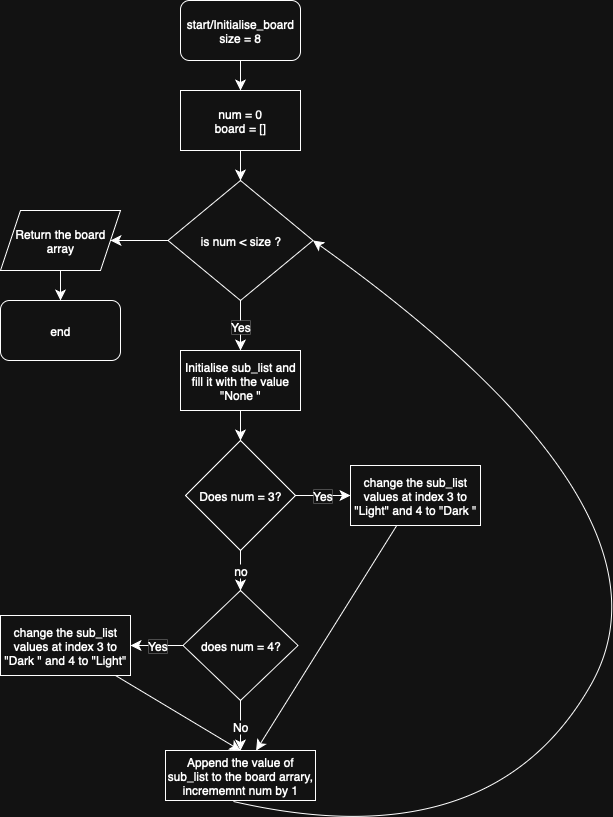
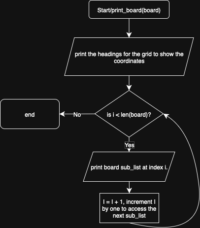
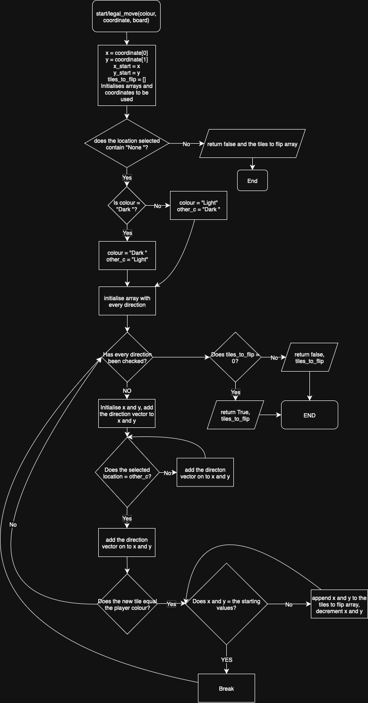
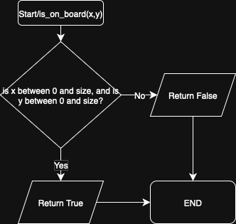
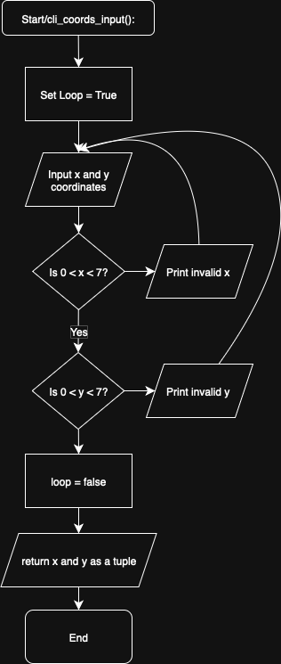
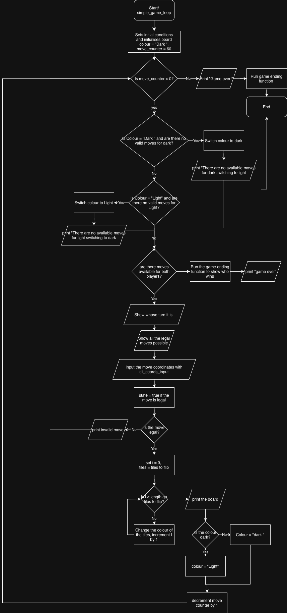
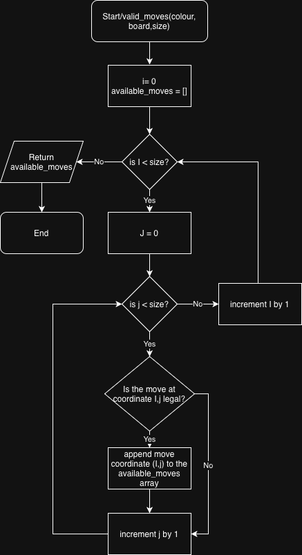
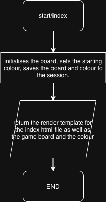
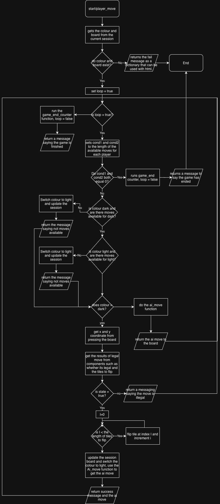
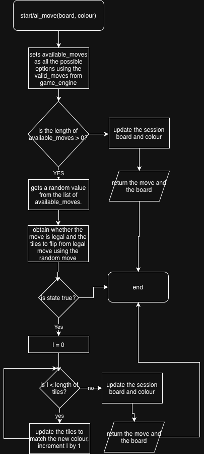

# Coursework 2 documentation

### Components flowcharts:

I created the inital components module with all of the python  code used for running the game. This includes 4 of the main functions needed to run the program.

#### initialise_board function

The first function that I created was the initalise_board function. It takes one parameter which is size and that controls the dimentions of the board. Firstly, the function initalises 2 variables which are num and board. Num is a number that is initialised as 0 and is used as a looping condition. I used this as I can increment num each time the loop runs. This function uses a while loop that while num is less than size runs some code that creates a sublist consisting of the value "None " and then appendeds it to the board array. If num is 3 then the "None " value in that sublist at index 3 is changed to "Light" and at index 4 the value is changed to "Dark ". This happens again when num = 4 however in the reverse direction with "Dark " at index 3 and "Light" at index 4. I used these if statements while adding to my code as it is less complex than changing the values after the board has been created  Num is incremented after the above if statements. This happens until num is greater than the size parameter and then the board array is returned. 

#### print_board function

This function is used to print the board. It takes the board as a parameter. It initally prints out a heading for the board. I did this as it makes the game easier to play in the command line as the coordinates are easier to see. I then used a for loop to iterate through the board list and access each sublist. I used the enumerate function in python as this allowed me to access each sublist as well as the index of each sublist. This was beneficial to me as I printed out the index of each sublist infront of each sublist. This made the coordinates easier to visualise for the user in the command line. 

#### legal_move function

The legal move function is used to check if each move is allowed and if tiles on the board can be flipped over. The function takes the board, coordinates of the move and the colour of the player as parameters. The function then checks to make sure that the locatation selected contains the string "None " as only an empty square can be played on. If the square does not contain "None " an error message is returned and the function ends. The function then sets a variable called other_c as the opposite colour to the player. This is so when the tiles are being checked they have to be the other players colour to be flipped. An array with every possible direction vector that tiles can be flipped in is also created. This array can be iterated through to change the initial x and y values to find different indexes in the array. I used a for loop to loop through the array having an x and y direction value and then used a while loop to check that while the coordinate is on the board using the is_on_board function and the colour of the tile selected plus the inital direction vector is not the players colour. It then adds the direction vector to x and y again until the players colour is reached. When the tile colour is the player colour the algoithm then backtracks and adds the tiles it has passed to an array called tiles_to_flip until the starting x and y values have been reached. The while loop ends here and the the next direction vector can be selected to check the next direction. At the end the tiles_to_flip is check to see how many values there are in the array. If the length of the array is greater than 0 the tiles_to_flip array is returned and True is returned. If not false is returned. 

#### is_on_board function

This is a very simple function that takes x,y and the size of the board as parameters and just checks if x is greater than or equal to 0 and less then the size of the board. It then returns true is the value is on the board and false if it is not on the board. I did this to simplify the process in legal_move as there does not need to be as much code to make sure x and y are valid. 

### Game_engine flowcharts:

The game_engine module is the main module of code needed to run the game in the command line. It uses the functions defined in components to run the game as well as some of its own functions. 

#### cli_coords_input function

This function is used to allow a user to enter x and y values to make a move in the game. The function starts by allowing the user to enter the x and y coordinate individually. It uses a while loop to allow the users to repeatedly enter a value until a valid coordinate has been selected. It then checks to make sure x and y are inside the given range and ends the loop if the coordinates are valid. X and y are then returned as a tuple. 

#### simple_game_loop function

This function is the main game loop used to run the game in the command line. It also uses the components functions to simplify the code. It firstly sets the inital conditions for the game to run. These include setting the colour to "Dark " and initialising the board using the initialise_board function. The board is then printed and the move counter is set to 60. The function uses a while loop that checks that while the move counter is greater than 0 the game runs. The function checks if each player has moves available and switches player if no moves are available. It does this using the valid_moves function. If each player has no moves available the function ends and the game_end_counter function runs to count up the tiles and display who wins. If there are moves available the players colour is printed and all of the available moves are printed as well. I did this as it makes it easier to see avaiable moves as it can be difficult in the command line. The function then uses the cli_coords_input function to obtain the coordinates from the user and checks if the move is valid using the legal_move function from components. If the move is valid the function uses the tiles_to_flip array returned from legal moves and stores them as tiles. It then iterates through this array until all of the tiles needed to flip have been flipped. The player colour is then switched and the move-counter is decremented. If the move is not legal, an error message is printed and the player is able to enter a new move. Once the move_counter reaches 0 the game_end_counter function is used that displays who wins and a game over message is dispalyed. 

#### valid_moves function

This function is used to find all of the moves available to the user and takes the board and the player as parameters. It sets the initial conditions such as i = 0 and creates an array called available_moves. It then iterates through each sublist in the board and does the legal_move function from components on each square to determine if the move is legal. If legal moves returns true for one of the squares then that index value is appended to the available_moves array. This array is then returned. I have used this function to make the game easier to play in the command line as all of the moves are presented to the user and it is much easier to visualise where they can go. 

#### game_end_counter function

This function is used to count up the number of tiles each player has so a winner can be decided. It sets inital conditions such as i = 0 , dark = 0 and light = 0 The function works by taking the board as a parameter and iterating through each sublist in the board list and counting up how many tiles "Dark " or "Light" appears. When it has finished an appropriate message is displayed that shows who has won or if the game is a draw. 

### flask_game_engine flowcharts: 

This code module was made to allow the game to run using a GUI and uses the index.html template and flask to allow the game to run using a python back-end. In this module I used 4 different functions  

#### index function

This function is used to set the inital conditions for the game to run. It uses the initialise_board function from the components module and sets the starting colour to "Dark ". It then uses the flask session module to save colour and board to the session so they cna be used later by other functions. It then returns the flask render_template to allow the index.html to interact with the python flask file. 

#### player_move function

This is the main game function that allows the player to make a move in the game. The function first works by retreving the player turn from the session and then checks to make sure that they have a value, ending the function and returning an error if they don't. The function then sets a loop condition to true and begins a while loop. The loop starts by verifying that the player has a move available, if no moves are available for each player the game ends. If one player does not have a move available the colour is switched to the other player and the session is updated. If the colour is "Dark " the function uses the request flask module to get the user input in the grid in the html file. It then subtracts 1 from each of the grid values as the grid input is from 1-8 whereas the game code is designed to work from 0-7 instead. It then saves this input as a tuple in the coords variable which can be used in the legal_move function from components. If the move is legal, the tiles are flipped using a while loop and the board and colour are updated. If the move is not valid then an error message is displayed and the user can play again. If it is not "Dark "s turn then the ai_move funciton is called and then the board is updated with the result of the ai_move function. 

#### ai_move function

This function is used to allow a player to play the game against a computer. This function works by using the valid_moves function from the game_enigine module to obtain all of the possible moves the player can make. Then a random move is selected from that array and used as the ai move. If there are no moves available then the colour is switched back to black and the function returns the board with no updated ai move. I used a randomised move as in the specification the game should give an advantage to the player and having a randomly selected move achieves this. It is possible that the computer can select a series of good moves however in general its moves are worse choices so the human will have a clear advantage.

#### game_end_counter function

This function is the same as the game_end_counter function above, however instead of producing a command line printed result, it returns the outcome in a different format so it can be work with the GUI interface. 

